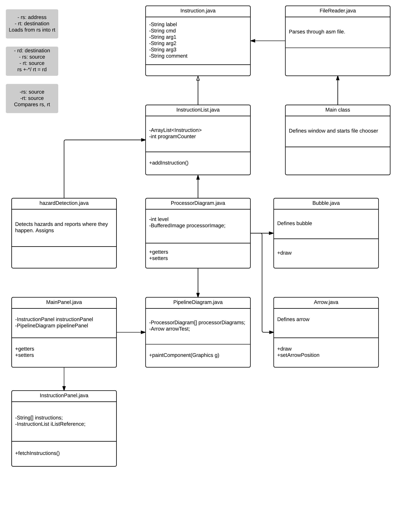

# Project 2 Proposal
### *MIPS Hazard Visualizer*

* **Person**[  ] Composition = *new* **Person**[4];
 * Composition[0] = "Joshua Fan";
 * Composition[1] = "Swati Gupta";
 * Composition[2] = "Xiaoxiang Cao";
 * Composition[3] = "Nitzan Orr";

#### Date:
**May 19th, 2016**

### Table of Contents
* 1.0 [Project Overview](#1.0)
  * 1.1 [Abstract](#1.1)
  * 1.2 [Target Customer](#1.2)
  * 1.3 [Search Words](#1.3)
  * 1.4 [Scope and Objectives](#1.4)
* 2.0 [Team and Constraints](#2.0)
  * 2.1 [Team Profile](#2.1)
  * 2.2 [Challenges](#2.2)
  * 2.3 [Assumptions and Constraints](#2.3)
* 3.0 [Deliverables and Milestones](#3.0)
  * 3.1 [Project Deliverables](#3.1)
  * 3.2 [Schedule and Budget Summary](#3.2)

## 1.0 Project Overview

#### 1.1 Abstract
***MIPS Hazard Visualizer*** is an application that helps CS 10 students to visualize where data hazards are mitigated in a pipelined MIPS architecture. Students can enter MIPS assembly instructions and see a visual representation of where forwarding (bypassing) and bubbles (stalls) will occur when the code is executed on a processor that supports pipelining. 
This program will help students to understand the pipelined processor architecture and the complexities it entails by enabling them to step through their program, one instruction at a time and see where forwarding and bubbles happen. They will be able to apply their understanding in their CS 10 course and future endeavors.

#### 1.2 Target Customer
The clients of this product students who are learning about computer architecture. Specifically, students at Foothill who are taking CS 10 will find this program particularly helpful. Educators will also find this to be a useful instructional tool in the classroom.

* ***Users:***
 * Computer Science Students
 * Computer Science Teachers

#### 1.3 Search Words
*Pipeline, hazard, visualizer, CS 10, computer architecture, computer science, bubble, stall, forwarding, bypassing, CPU, MIPS, data hazard, processor, simulator, educational*

#### 1.4 Scope and Objectives

The objective is to build a working system that aids in teaching of computer architecture, especially for teaching subtle differences between processor architectures.  
that is flexible and responsive to change. Via this group project, the focus is on learning how to divide a big project into smaller doable parts, how to work in team and how to use each team member's strong suit.

While following the agile process of software development, team has decided to take the simplest path and building a software system that can be used for entertainment and education. We may use existing codes, libraries and build on them.

##### *Features:*
* Desktop program built in Java
* Visually represented pipeline stages
* Visually represented data hazards and their mitigations: forwarding and bubbles
* Step-by-step walkthrough of MIPS assembly instructions. 

##### *Design and Implementation:*
Users will be prompted to choose an .asm MIPS assembly file. Then, the instructions will be visually represented by a pipeline diagram. On the diagram, arrows and "no entry" signs will be shown to denote forwarding and bubbles, respectively. Users will be able to step through the instructions, observing data hazard mitigation appearing in the pipeline.

###### *UML Diagram*

## 2.0 Team and Constraints

#### 2.1 Team Profile
***Josh***
 * Algorithms

***Xiaoxiang***
 * CS 10
 * Proficiency in Git basics and rudimentary knowledge of advanced Git
 * Basic Markdown editing skills

***Nitzan***
 * Long experience with Java
 * Familiarity with Java API
 * CS 1A, 1B

#### 2.2 Challenges
* Stepping through instructions while keeping the arrows and bubbles in the right place was difficult.
* Designing a program that is easy to understand.

#### 2.3 Assumptions and Constraints

* ***Non-technical Constraints***
 * Time
    * Each team member is taking other courses too
    * Less than 4 weeks to code.
 * Not all team members have a laptop
* ***Technical Constraints***
 * Implementation of advanced UI features will take time because of need to learn about them prior to coding.
 * Scalable design that will allow addition of possible features and continued maintainability

## 3.0 Deliverables and Milestones

#### 3.1 Project Deliverables

* Project Proposal
* UML diagram
* Source Code
* Screen Shots
* Presentation about final product

#### 3.2 Schedule and Budget Summary

| Item                       	| Date                  |
| :---------------------------|:----------------------|
| Proposal Presentation	      | Thurs, May 19, 2016   |
| Project Proposal		          | Sat, May 21, 2016     |
| File reader			             	| Tue, May 24, 2016     |
| Instruction storage		      	| Thurs, May 26, 2016   |
| Sprint 1		                		| Mon, May 30, 2016     |
| Pipeline graphics			        | Thurs, June 2, 2016   |
| Assembly interpreter		     	| Thurs, May 26, 2016   |
| Hazard detection			         | Thurs, June 10, 2016  |
| Hazard mitigation display	 	| Mon, June 13, 2016    |
| Sprint 2 		               		| Thurs, June 2, 2016   |
| Functional prototype		     	| Sat, April 30, 2016   |
| Scrolling animation		      	| Sun, April 31, 2016   |
| Sprint 3				                | Thurs, June 9, 2016   |
| GUI polish		              		| Mon, May 9, 2016      |
| Demonstration and Delivery		| Thurs, June 16, 2016  |
